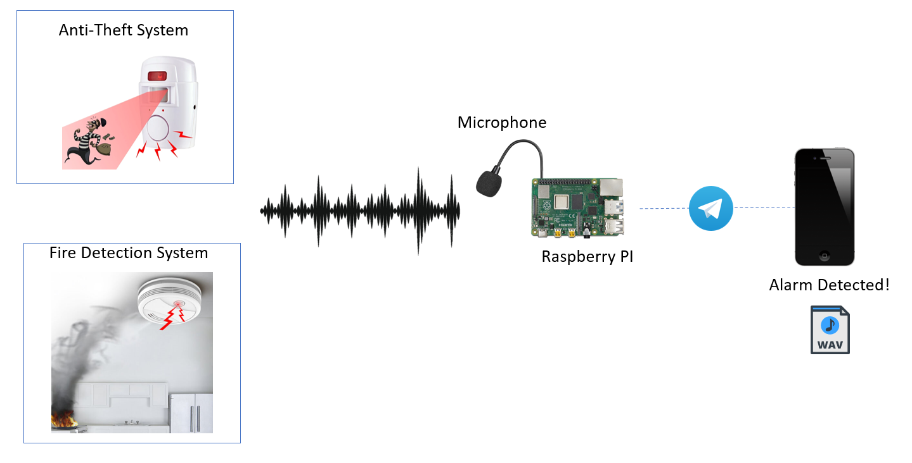

# pyAlarmGuard

Python project for Raspberry PI (or other similar boards) to enforce your home security.

The current implementation can be summarized by the following image:

Imagine to have an audio alarm system (e.g. fire detection system, anti-theft system, etc.). This project has the goal to use a microphone to hear for alarm sounds. When an alarm sound is detected, the system will send to your smartphone a notification with eventually attached evidences (e.g. recorded audio).
pyAlarmGuard can support also a camera featuring object/human detection powered by MobileNetSSD (really fast even on raspberry pi).

The project has the `carriers` directory that contains all available notification methods. Currently only Telegram messages are supported, but future implementations could include emails or other IM apps. Carriers can also perform actions, even if their scope is to notify the user, they can eventually receive commands to execute.

The `sensors` directory contains all the available sensors. Audio recording through microphone and photos from camera are supported. Future implementations could include videos from camera, motion-detection systems, etc.

The `detectors` directory contains tools and algorithms to perform several analysis, currently only alarm detection and human detection are implemented.

The project aims to provide a general structure easy to customize, in order to implement your home security system.

# Installation

Install on the system the package `sox`
Then run `pip install -r requirements.txt`

Before to run the project you need to rename `config_example.py` into `config.py` in the root project directory adding the configuration for Telegram (api key and chat id).