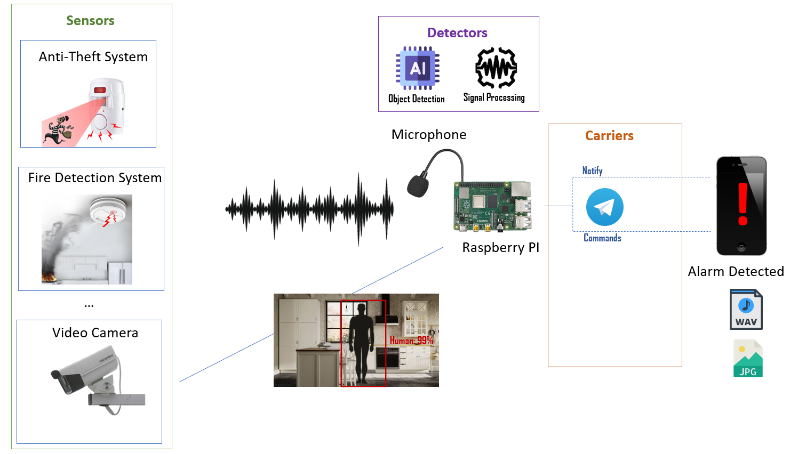

# pyAlarmGuard

Python project for Raspberry PI (or other similar boards) to enforce your home security.

The current implementation can be summarized by the following image:

Imagine to have an audio alarm system (e.g. fire detection system, anti-theft system, etc.). This project has the goal to use a microphone to hear for alarm sounds. When an alarm sound is detected, the system will send to your smartphone a notification with eventually attached evidences (e.g. recorded audio).
pyAlarmGuard can support also a camera featuring object/human detection powered by MobileNetSSD (really fast even on raspberry pi).

The project has the `carriers` directory that contains all available notification methods. Currently only Telegram messages are supported, but future implementations could include emails or other IM apps. Carriers can also perform actions, even if their goal is to notify the user, they can eventually receive commands to execute.

The `sensors` directory contains all the available sensors. Audio recording through microphone and photos from camera are supported. Future implementations could include videos from camera, motion-detection systems, etc.

The `detectors` directory contains tools and algorithms to perform several analysis, currently only alarm detection and human detection are implemented.

The project aims to provide a general structure easy to customize, in order to implement your home security system.

# Installation

Install on the system the package `sox` and optionally `vlc`
Then run `pip install -r requirements.txt`
Please check also the requirements of the subproject dejavu3 in the `detectors/dejavu3/` directory.

Before to run the project you need to rename `config_example.py` into `config.py` in the root project directory adding the configuration for Telegram (api key and chat id).

## Technical Details

The `detectors` are wrapped by `Detector` class (in `detectory.py` file).
Alarm detection is performed first using an audio correlation algorithm (dejavu3) and then measuring db level.

Dejavu3 is derived from [dejavu](https://github.com/worldveil/dejavu), but modified to use a local sqlite database `audio.db`.

Each time, recorded audio is compared to sounds already known (saved in the database) using Dejavu3 algorithm. It is possible to add new sounds putting `wav` files inside the `detectors/dejavu3/samples/` directory. The name of the `wav` file represents its label.

If the audio recorded from mic results to have a correlation to a known sound (found in `audio.db`) its label is retrieved. If the label (i.e. the filename) starts with the `exclude` keyword, the current recording is considered as a sound to ignore (e.g. noise). Otherwise if the label starts with the `include` keyword, the current recording is considered as an alarm.

When the dejavu3 algorhitm fails to classify the recorded audio, then it's applied a sinc filter and measured RMS dB level. If the dB level is greather then a defined threshold, the alarm notification will be triggered.

Logs are saved in `pyalarmguard.log` file in the project directory.

## Supported Commands
Telegram carrire implements several commands that are described below:

*  `/stop` stop all detectors
*  `/stoph` stop only human detection
*  `/start` start all detectors
*  `/status` get system status
*  `/poweroff` shutdown the system
*  `/play` play a song/sound (if the raspberry has a speaker)
*  `/getphoto` get a photo from camera
*  `/getaudio n` get an audio of n seconds (recording is done with a background thread)
*  `/setdblevel n` set the db level threshold for alarm detection
